# SQL Problem Sets (Ongelmajoukot)

## Yhteen tauluun kohdistuvien kyselyiden harjoitukset:

### Tehtävä 1:

SELECT * from goal;

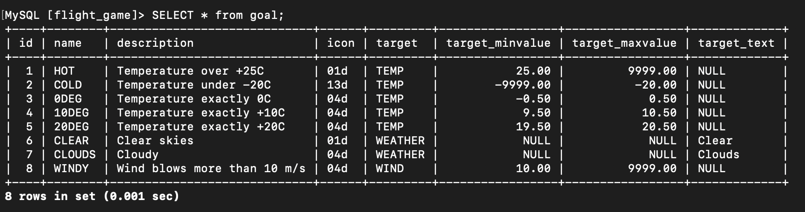

### Tehtävä 2:

SELECT name, type FROM airport WHERE iso_country = "FI";

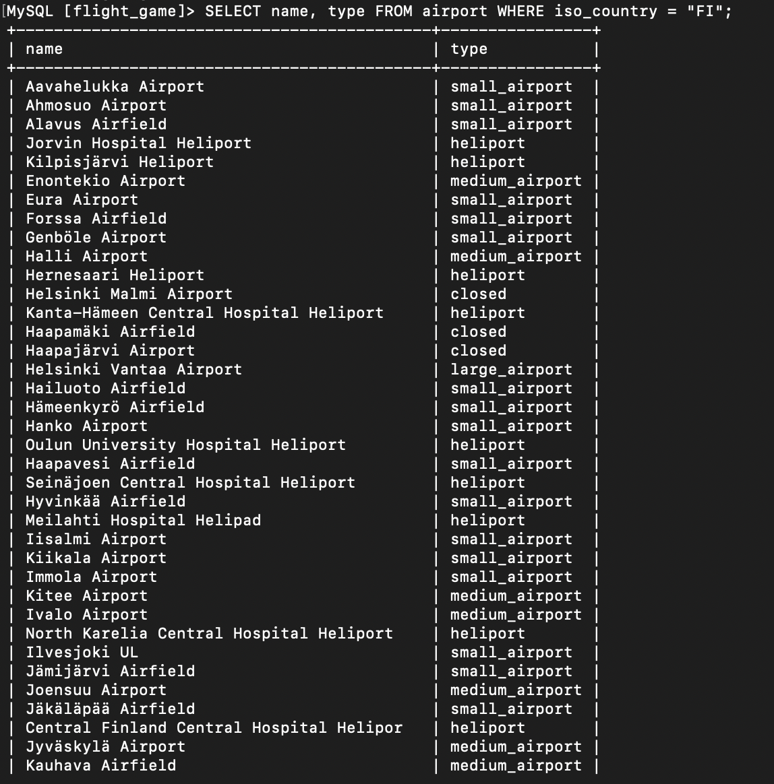

### Tehtävä 3:

SELECT name FROM airport WHERE iso_country = "FI";

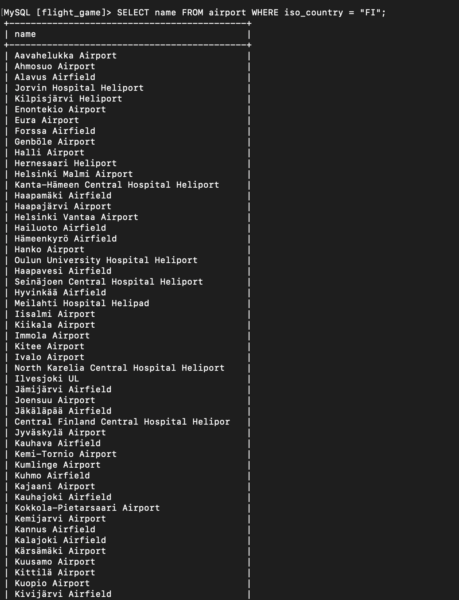

### Tehtävä 4:

SELECT name, type FROM airport WHERE iso_country = 'FI' ORDER BY type ASC, name ASC;

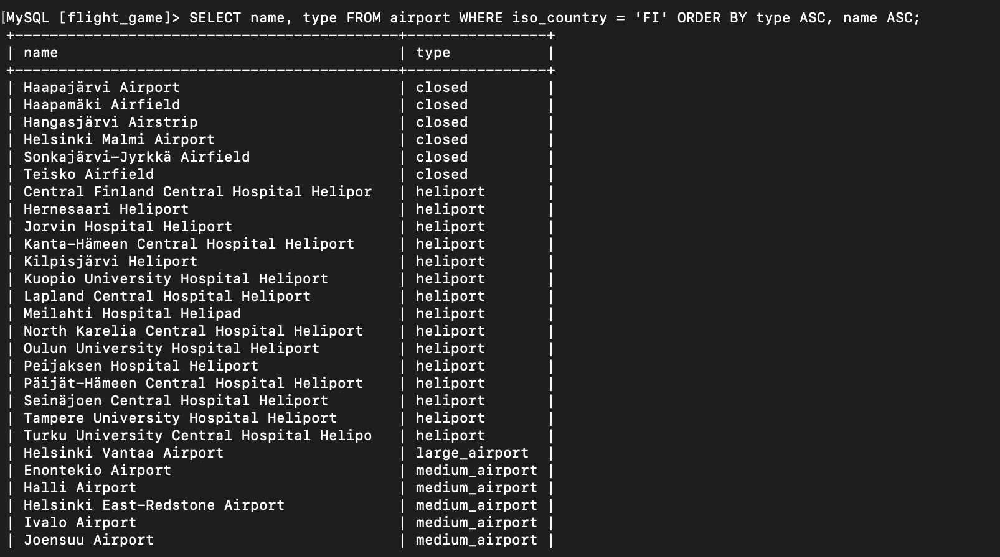

### Tehtävä 5:

SELECT name FROM country WHERE name LIKE 'F%';

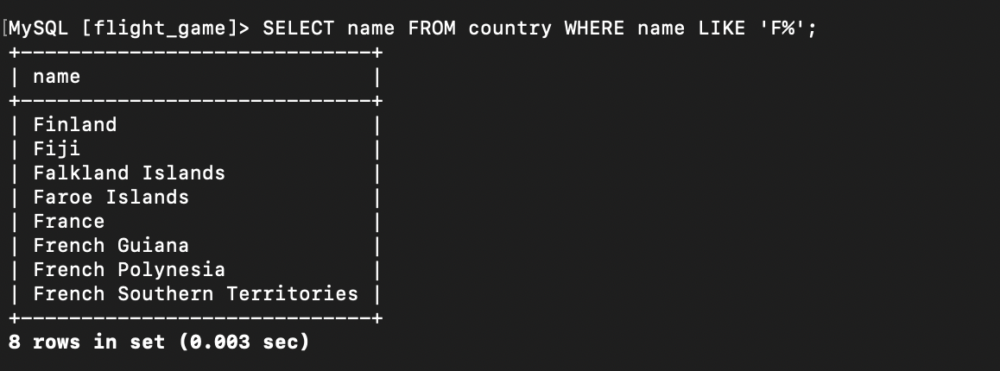

### Tehtävä 6:

SELECT name FROM country WHERE name LIKE '%F%';

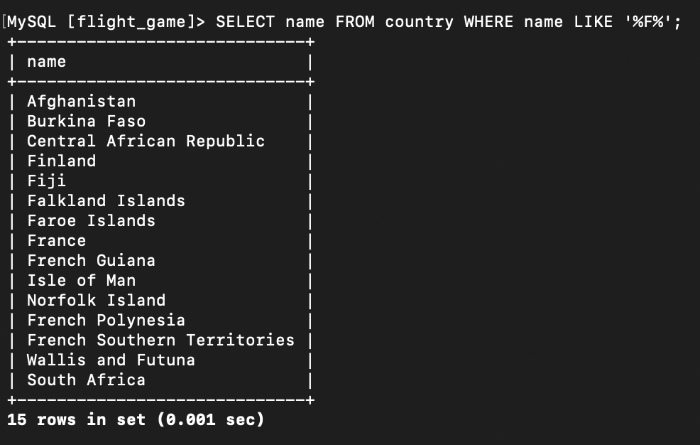

### Tehtävä 7:

SELECT location FROM game WHERE screen_name = 'Vesa';

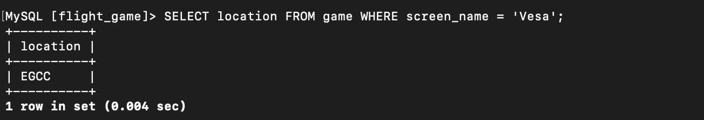

### Tehtävä 8:

SELECT co2_consumed FROM game WHERE screen_name = 'Ilkka';

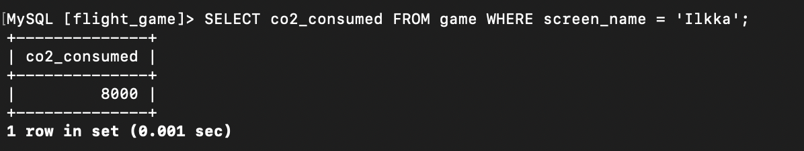

### Tehtävä 9:

SELECT DISTINCT co2_budget FROM game;

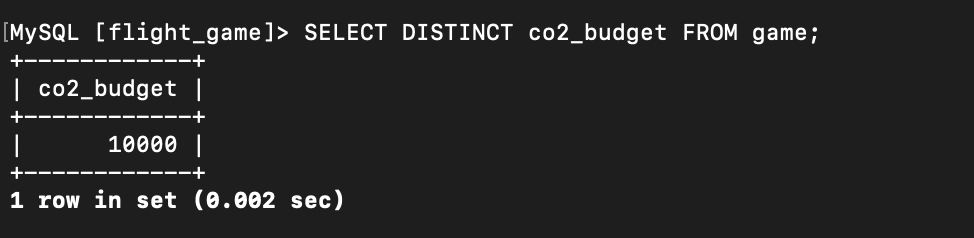

## Where-osan liitosehto harjoitukset:

### Tehtävä 1:

SELECT country.name AS "country name", airport.name AS "airport name" FROM country JOIN airport ON country.iso_country = airport.iso_country WHERE country.name = 'Iceland';

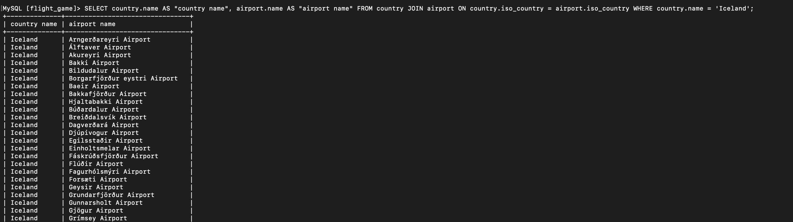

### Tehtävä 2:

SELECT name AS "airport name" FROM airport WHERE iso_country = 'FR' AND type = 'large_airport';

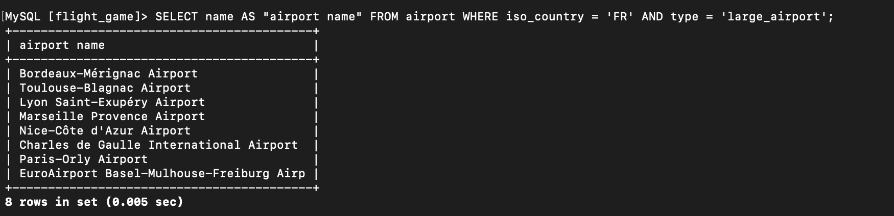

### Tehtävä 3:

SELECT country.name AS country_name, airport.name AS airport_name FROM airport JOIN country ON airport.iso_country = country.iso_country WHERE airport.continent = 'AN';

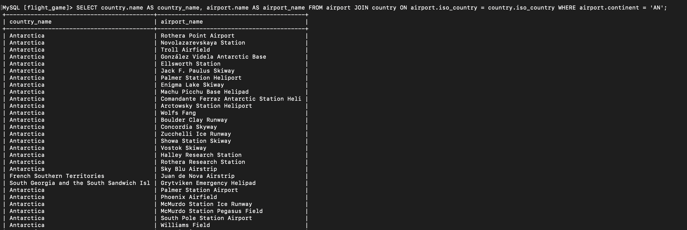

### Tehtävä 4:

SELECT elevation_ft FROM airport JOIN game ON airport.ident = game.location WHERE game.screen_name = 'Heini';

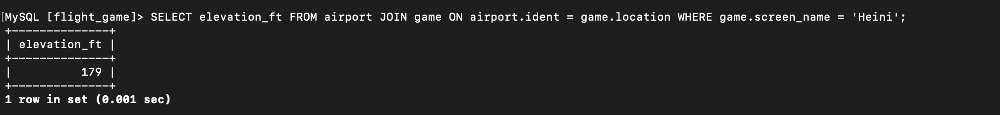

### Tehtävä 5:

SELECT elevation_ft * 0.3048 AS elevation_m FROM airport JOIN game ON airport.ident = game.location WHERE game.screen_name = 'Heini';

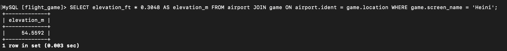

### Tehtävä 6:

SELECT airport.name FROM airport JOIN game ON airport.ident = game.location WHERE game.screen_name = 'Ilkka';

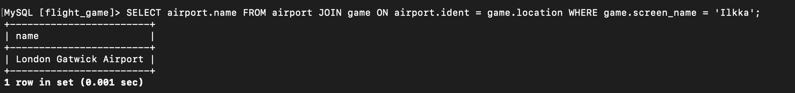

### Tehtävä 7:

SELECT DISTINCT country.name FROM country JOIN airport ON country.iso_country = airport.iso_country JOIN game ON airport.ident = game.location WHERE game.screen_name = 'Ilkka';

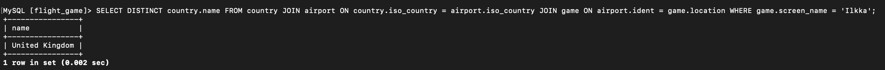

### Tehtävä 8:

SELECT goal.name FROM goal JOIN goal_reached ON goal.id = goal_reached.goal_id JOIN game ON goal_reached.game_id = game.id WHERE game.screen_name = 'Heini';

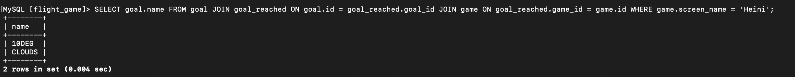

### Tehtävä 9:

SELECT DISTINCT airport.name FROM airport JOIN goal_reached ON airport.ident = (SELECT location FROM game WHERE screen_name = 'Ilkka') JOIN goal ON goal_reached.goal_id = goal.id WHERE goal.name = 'clouds';

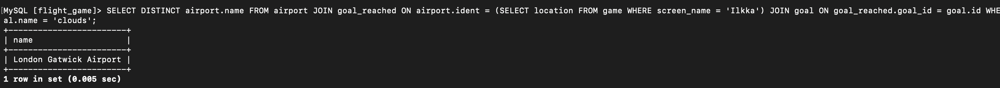

### Tehtävä 10:

SELECT DISTINCT country.name FROM country JOIN airport ON country.iso_country = airport.iso_country JOIN goal_reached ON airport.ident = (SELECT location FROM game WHERE screen_name = 'Ilkka') JOIN goal ON goal_reached.goal_id = goal.id WHERE goal.name = 'clouds';

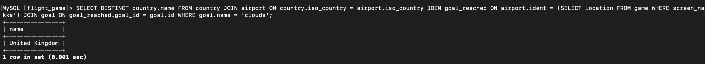

## Join harjoitukset:

### Tehtävä 1:

SELECT country.name AS "country name", airport.name AS "airport name" FROM airport JOIN country ON airport.iso_country = country.iso_country WHERE country.name = 'Finland' AND airport.scheduled_service = 'yes';

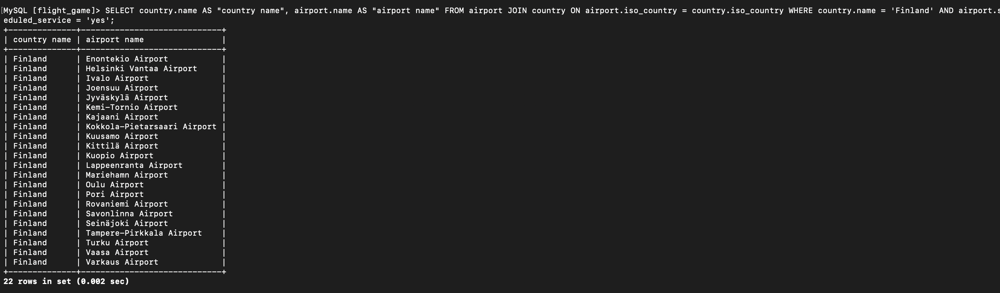

### Tehtävä 2:

SELECT game.screen_name, airport.name FROM game JOIN airport ON game.location = airport.ident;

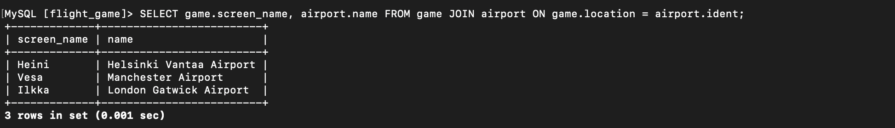

### Tehtävä 3:

SELECT game.screen_name, country.name FROM game JOIN airport ON game.location = airport.ident JOIN country ON airport.iso_country = country.iso_country;

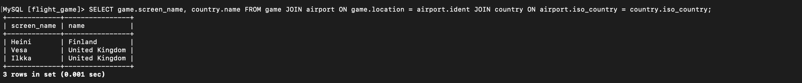

### Tehtävä 4:

SELECT airport.name, game.screen_name FROM airport LEFT JOIN game ON airport.ident = game.location WHERE airport.name LIKE '%Hels%';

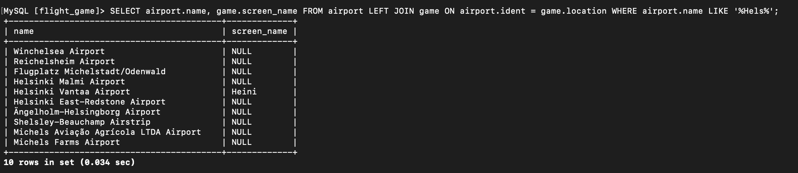

### Tehtävä 5:

SELECT goal.name AS "goal name", game.screen_name FROM goal JOIN goal_reached ON goal.id = goal_reached.goal_id JOIN game ON goal_reached.game_id = game.id;

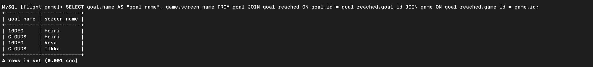

## Sisäkysely harjoitukset:

### Tehtävä 1:

SELECT country.name FROM country JOIN airport ON country.iso_country = airport.iso_country WHERE airport.name LIKE 'Satsuma%';

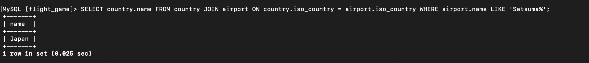

### Tehtävä 2:

SELECT airport.name FROM airport JOIN country ON airport.iso_country = country.iso_country WHERE country.name = 'Monaco';

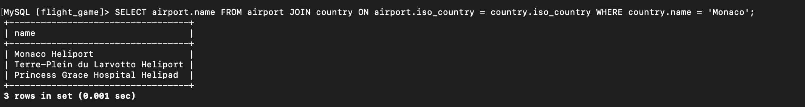

### Tehtävä 3:

SELECT game.screen_name FROM game JOIN goal_reached ON game.id = goal_reached.game_id JOIN goal ON goal_reached.goal_id = goal.id WHERE goal.name = 'CLOUDS';

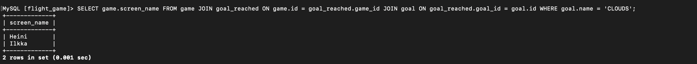

### Tehtävä 4:

SELECT country.name FROM country WHERE country.iso_country NOT IN (SELECT DISTINCT airport.iso_country FROM airport);

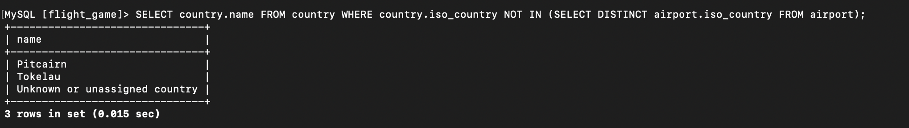

### Tehtävä 5:

SELECT goal.name FROM goal WHERE goal.id NOT IN (SELECT goal.id FROM goal JOIN goal_reached ON goal.id = goal_reached.goal_id JOIN game ON goal_reached.game_id = game.id WHERE game.screen_name = 'Heini');

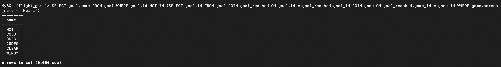

